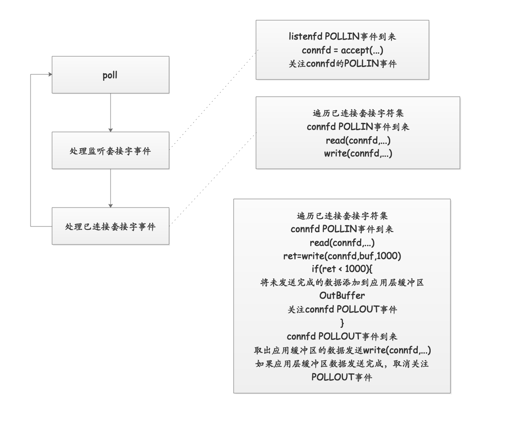

## `Linux I/O`多路复用
### `poll`
函数原型：
```cpp
#include <poll.h>

/**
 * @brief 
 * 
 * @param fds 监听文件描述符集合
 * @param nfds 监听文件描述符个数
 * @param timeout 超时时间
 * @return int 就绪文件描述符个数
 */
int poll(struct pollfd *fds, nfds_t nfds, int timeout);

struct pollfd {
  int   fd;      // 文件描述符
  short events;  // 请求事件
  short events;  // 响应事件
};

```
#### `poll`使用的基本流程

`SIGPIPE`信号：
在`TCP`网络通信中，如果`client`关闭了套接字，服务器此时调用了一次`write`，服务器会收到
一个`RST segment(TCP传输层)`，如果服务器再次调用`write`会产生一个`SIGPIPE`信号。
**如果服务器没有忽略`SIGPIPE`信号，会导致服务器进程退出。**

`TIME_WAIT`状态对大并发服务器的影响：
产生时机： 服务器主动断开连接(先于`client`关闭套接字)，服务器就会进入`time_wait`状态。
避免服务端`time_wait`状态： 在协议的设计上，将套接字断开分散到客户端，这样将`time_wait`状态转移到大量的客户端上。
服务器也要有机制剔除不活跃的连接。


