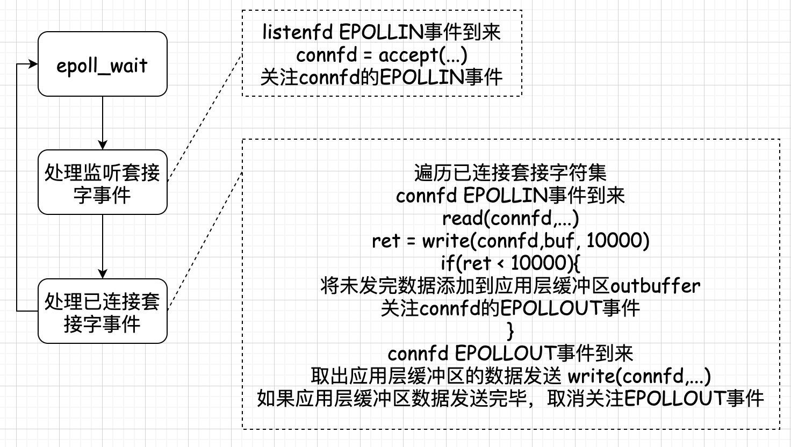
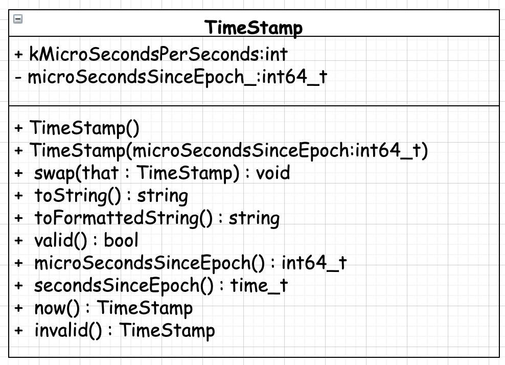
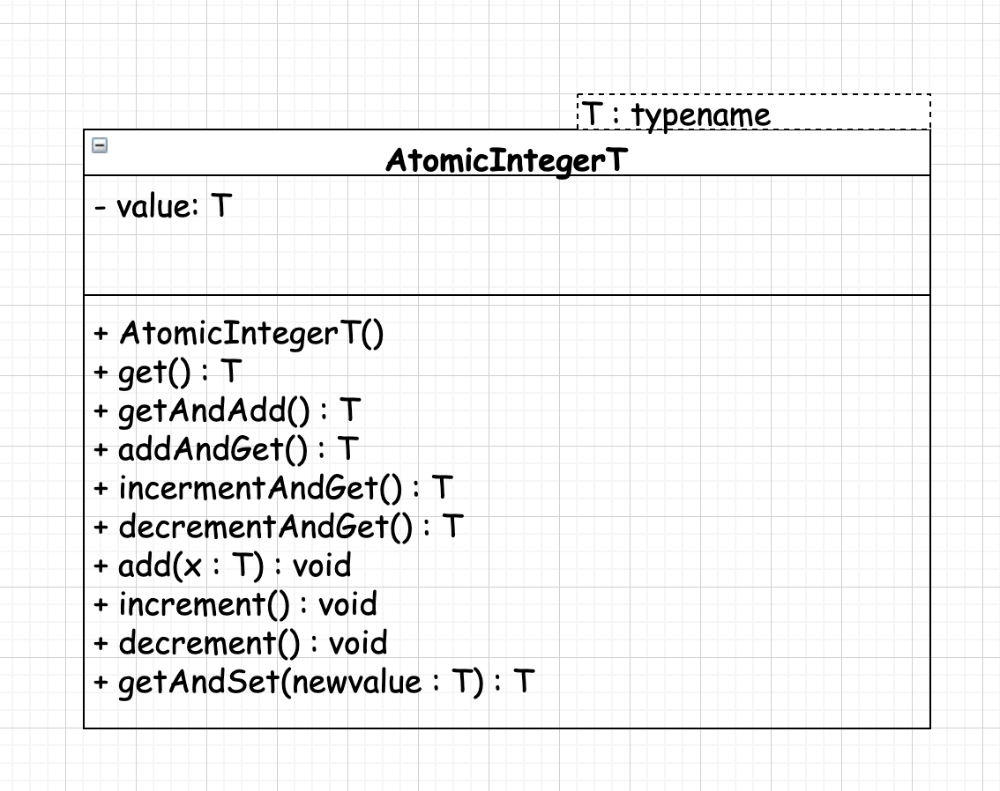

## 服务器性能四大杀手
1. 数据拷贝 缓存
2. 环境切换 改不改用多线程，单核服务器使用状态机编程效率最好
3. 内存分配
4. 锁竞争

## `poll` 
```cpp
#include <poll.h>

int poll(struct pollfd *__fds, nfds_t __nfds, int __timeout);

struct pollfd {
  int   fd;
  short events;
  short revents;
};
```

在`TCP`编程时，一般第一步就要忽略`SIGPIPE`信号。
```cpp
signal(SIGPIPE, SIG_GIN);
```
如果客户端关闭了套接字(`close`)，而服务器调用了一次`write`，服务端会收到一个`RST segment(TCP 传输层)`，如果服务器再次调用`write`，就会收到`SIGPIPE`信号。
`SIGPIPE`信号，默认处理行为：退出进程。

`TIME_WAIT`: 应该尽量避免服务端主动断开连接，在协议设计时，应该将大量的`TIME_WAIT`状态分散到`client`端。
如果客户端不活跃，一些客户端不断开连接，会大量占用服务器连接资源。

`accept`返回`EMFILE`的处理：
* 调高进程描述符数目
* 死等
* 退出程序
* 关闭监听套接字
* 如果是`epoll`模型，可以改用`edge trigger`模式，问题是如果漏掉了一次`accept`将不会再接收新的连接
* 准备一个新的空闲文件描述符。接收到连接时，先关闭该空闲文件描述符，获得一个文件描述符名额，在`accept`拿到`socket`连接的文件描述符，立刻`close`优雅断开与客户端的连接，最后重新打开空闲文件描述符。

```cpp
#include <sys/epoll.h>

int epoll_create(int size);
int epoll_create1(int flags);

int epoll_ctl(int epfd, int op, int fd, struct epoll_event *event);
int epoll_wait(int                 epfd,
               struct epoll_event *events,
               int                 maxevents,
               int                 timeout);

typedef union epoll_data {
  void *   ptr;
  int      fd;
  uint32_t u32;
  uint64_t u64;
} epoll_data_t;

typedef epoll_event {
  uint32_t     events;
  epoll_data_t data;
};
```


### `poll`模型
每次调用`poll`函数时，都需要把监听套接字和已连接套接字所感兴趣的事件数组拷贝到内核。

`select/poll/epoll`的区别：

|   类型   |                                                                                                                                                                                                                                                      原理                                                                                                                                                                                                                                                       |
| :------: | :-------------------------------------------------------------------------------------------------------------------------------------------------------------------------------------------------------------------------------------------------------------------------------------------------------------------------------------------------------------------------------------------------------------------------------------------------------------------------------------------------------------: |
| `select` |                                                                                                                                本质上是通过设置或检查存放`fd`标志位的结构来进行下一步处理，但这样有以下的缺点：**单个进程可监视的`fd`个数被限制；** **需要维护一个存放大量`fd`的数据结构，这样使得用户空间和内核空间在传递该结构时复制开销很大；** **对socket扫描是线性扫描。**                                                                                                                                 |
|  `poll`  | 本质上与`select` 没有区别，将用户传入的数据拷贝到内核空间，然后查询每个`fd`对应的设备状态，如果设备就绪则在设备就绪队列中增加一项并继续遍历，如果遍历完所有的`fd`后没有发现就绪设备，则挂起当前进程，直到设备就绪或主动超时，被唤醒后再次遍历`fd`,这个过程中进行了多次无谓的`fd`遍历。 **`poll`没有最大连接数限制，因为基于链表存储；** **大量的`fd`的数组被整体复制与用户态和内核态空间，无论该复制是否有意义；** **`poll`还有一个水平触发的特点，如果报告了`fd`之后没有被处理，下次`poll`将继续报告该`fd`。** |
| `epoll`  |                                                                                                                                                            **`epoll`采用`mmap`减少复制开销。**  **`epoll`使用事件就绪通知的方式，通过`epoll_ctl`注册`fd`，一旦该`fd`就绪内核就会采用类似`callback`的方式来激活该`fd`,`epoll_wait`便可以收到通知。**                                                                                                                                                             |

进程能够打开的最大连接数:
| 类型     | 一个进程能打开的最大连接数                                                                             |
| :------- | :----------------------------------------------------------------------------------------------------- |
| `select` | 单进程能打开的最大连接数有`FD_SETSIZE`宏定义，默认大小为`32`个整数的大小，可以通过编译内核进行修改     |
| `poll`   | 本质上与`select`相同，但没有最大连接数限制，其基于链表存储。                                           |
| `epoll`  | 虽然有连接数限制，但其数目很大，`1G`内存的机器最大可以打开`10万`个连接，`2G`机器上可以打开`20万`个连接 |

`fd`剧增后带来的`IO`效率问题：
| 类型     | `fd`剧增后带来的`IO`效率问题                                                                                                                                                                    |
| :------- | :---------------------------------------------------------------------------------------------------------------------------------------------------------------------------------------------- |
| `select` | 因为每次调用都会对连接进行线性遍历，`FD`增加会造成遍历速度慢的“线性下降的性能问题”。                                                                                                            |
| `poll`   | 因为每次调用都会对连接进行线性遍历，`FD`增加会造成遍历速度慢的“线性下降的性能问题”。                                                                                                            |
| `epoll`  | 在`epoll`内核中实现是根据每个`fd`上的`callback`函数来实现的，只有获取的`scoket`才会主动调用`callback`，所以在`socket`较少的情况下，没有上述问题，但在`socket`量巨大的情况下，可能存在性能问题。 |

### `MUDUO`库

可复制类定义：
```cpp
#ifndef __CAPYABLE_H__
#define __CAPYABLE_H__

namespace muduo {
class Copyable {
protected:
  Copyable()  = default;
  ~Copyable() = default;
};
}  // namespace muduo

#endif /* __CAPYABLE_H__ */

```

类型转换类：
```cpp
#ifndef __TYPES_H__
#define __TYPES_H__

#include <assert.h>
#include <stdint.h>
#include <string.h>
#include <strings.h>

#include <boost/operators.hpp>
#include <cstddef>

namespace muduo {

using std::string;

inline void memZero(void *p, size_t n) {
  memset(p, 0, n);
}

template <typename To, typename From>
inline To implicit_cast(From const &f) {
  return f;
}

template <typename To, typename From>
inline To down_cast(From *f) {
  if (false) {
    implicit_cast<From *, To>(0);
  }

  return static_cast<To>(f);
}

}  // namespace muduo

#endif /* __TYPES_H__ */

```

线程对象生命周期与线程的生命周期不同。
线程执行完成之后，线程对象可以自动销毁。
```cpp
#ifndef __THREAD_H__
#define __THREAD_H__

#include <pthread.h>

class Thread {
public:
  Thread();
  virtual ~Thread();

  void Start();
  void Join();

private:
  static void *ThreadRoutine(void *arg);

  virtual void Run() = 0;
  pthread_t    threadId_;
};  // class Thread

#endif /* __THREAD_H__ */


#include "Thread.h"

#include <iostream>

Thread::Thread() {
  std::cout << "Thread ..." << std::endl;
}

Thread::~Thread() {
  std::cout << "~Thread ..." << std::endl;
}

void Thread::Join() {
  pthread_join(threadId_, nullptr);
}

void Thread::Start() {
  pthread_create(&threadId_, NULL, ThreadRoutine, this);
}

void *Thread::ThreadRoutine(void *arg) {
  Thread *thr = static_cast<Thread *>(arg);
  thr->Run();

  return nullptr;
}


#include <unistd.h>

#include <iostream>

#include "Thread.h"

class TestThread : public Thread {
public:
  TestThread(int count) : count_(count) {
    std::cout << "TestThread ..." << std::endl;
  }

  ~TestThread() {
    std::cout << "~TestThread ..." << std::endl;
  }

  void Run() override {
    while (count_-- > -2) {
      std::cout << "TestThread Run ..." << std::endl;
    }
  }

private:
  int count_;
};  // class TestThread

int main(int argc, char **argv) {
  TestThread t(5);
  t.Start();
  t.Join();

  std::cout << "Main Thread ..." << std::endl;
  t.Run();  // 主线程中运行

  return 0;
}

```
`boost bind/function`
```cpp
/**
 * @file boostbind.cc
 * @author koritafei (koritafei@gmail.com)
 * @brief
 * @version 0.1
 * @date 2021-10-08
 *
 * @copyright Copyright (c) 2021
 *
 */

#include <boost/bind.hpp>
#include <boost/function.hpp>
#include <iostream>

class Foo {
public:
  void memberFunc(double d, int i, int j) {
    std::cout << "double d = " << d << std::endl;
    std::cout << "int i = " << i << std::endl;
    std::cout << "int j = " << j << std::endl;
  }

private:
};

int main(int argc, const char** argv) {
  Foo foo;

  boost::function<void(int, int)> fp =
      boost::bind(&Foo::memberFunc, &foo, 0.5, -1, 1000);
  fp(10, 2000);

  return 0;
}
```
### `base`源码分析
#### `timestamp`
值语义： 可以拷贝的，拷贝之后与原对象脱离关系；
对象语义： 要么不可以拷贝；要么可以拷贝，拷贝之后与原对象仍然存在一定的关系，比如共享底层资源。

毫秒时间类定义与实现如下：
```cpp
#ifndef __TimeStamp_H__
#define __TimeStamp_H__

#include <boost/operators.hpp>

#include "Copyable.h"
#include "Types.h"

namespace muduo {

class TimeStamp : public muduo::Copyable,
                  public boost::equality_comparable<TimeStamp>,
                  public boost::less_than_comparable<TimeStamp> {
public:
  TimeStamp() : microSecondsSinceEpoch_(0) {
  }

  explicit TimeStamp(int64_t microSecondsSinceEpoch)
      : microSecondsSinceEpoch_(microSecondsSinceEpoch) {
  }

  void swap(TimeStamp &that) {
    std::swap(this->microSecondsSinceEpoch_, that.microSecondsSinceEpoch_);
  }

  string toString() const;
  string toFormattedString(bool showMicroSeconds = true) const;

  bool valid() const {
    return microSecondsSinceEpoch_ > 0;
  }

  int64_t microSecondsSinceEpoch() const {
    return microSecondsSinceEpoch_;
  }

  time_t secondsSinceEpoch() const {
    return static_cast<time_t>(microSecondsSinceEpoch_ /
                               kMicroSecondsPerSecond);
  }

  static TimeStamp now();

  static TimeStamp invalid() {
    return TimeStamp();
  }

  static TimeStamp fromUnixTime(time_t t) {
    return fromUnixTime(t, 0);
  }

  static TimeStamp fromUnixTime(time_t t, int microSeconds) {
    return TimeStamp(static_cast<int64_t>(t) * kMicroSecondsPerSecond +
                     microSeconds);
  }

  static const int kMicroSecondsPerSecond = 1000 * 1000;

private:
  int64_t microSecondsSinceEpoch_;
};  // class TimeStamp

inline bool operator<(TimeStamp &lhs, TimeStamp &rhs) {
  return lhs.microSecondsSinceEpoch() < rhs.microSecondsSinceEpoch();
}

inline bool operator==(TimeStamp &lhs, TimeStamp &rhs) {
  return lhs.microSecondsSinceEpoch() == rhs.microSecondsSinceEpoch();
}

inline double timeDifference(TimeStamp &high, TimeStamp &low) {
  int64_t diff = high.microSecondsSinceEpoch() - low.microSecondsSinceEpoch();

  return static_cast<double>(diff) / TimeStamp::kMicroSecondsPerSecond;
}

inline TimeStamp addTime(TimeStamp t, double seconds) {
  int64_t delta =
      static_cast<int64_t>(seconds * TimeStamp::kMicroSecondsPerSecond);

  return TimeStamp(t.microSecondsSinceEpoch() + delta);
}

}  // namespace muduo

#endif /* __TimeStamp_H__ */


#include "TimeStamp.h"

#include <inttypes.h>
#include <stdio.h>
#include <sys/time.h>

using namespace muduo;

static_assert(sizeof(TimeStamp) == sizeof(int64_t),
              "TimeStamp shouble be same size as int64_t");

string TimeStamp::toString() const {
  char    buf[32] = {0};
  int64_t seconds = microSecondsSinceEpoch_ / TimeStamp::kMicroSecondsPerSecond;
  int64_t microSeconds =
      microSecondsSinceEpoch_ % TimeStamp::kMicroSecondsPerSecond;

  snprintf(buf,
           sizeof(buf),
           "%" PRId64 "%.06" PRId64 "",
           seconds,
           microSeconds);
  return buf;
}

string TimeStamp::toFormattedString(bool showMicroSeconds) const {
  char      buf[64] = {0};
  time_t    seconds = static_cast<time_t>(microSecondsSinceEpoch_ /
                                       TimeStamp::kMicroSecondsPerSecond);
  struct tm tm_time;
  gmtime_r(&seconds, &tm_time);

  if (showMicroSeconds) {
    int microSeconds = static_cast<int>(microSecondsSinceEpoch_) %
                       TimeStamp::kMicroSecondsPerSecond;
    snprintf(buf,
             sizeof(buf),
             "%4d%02d%02d %02d:%02d:%02d.%06d",
             tm_time.tm_year + 1900,
             tm_time.tm_mon + 1,
             tm_time.tm_mday,
             tm_time.tm_hour,
             tm_time.tm_min,
             tm_time.tm_sec,
             microSeconds);
  } else {
    snprintf(buf,
             sizeof(buf),
             "%4d%02d%02d %02d:%02d:%02d",
             tm_time.tm_year + 1900,
             tm_time.tm_mon + 1,
             tm_time.tm_mday,
             tm_time.tm_hour,
             tm_time.tm_min,
             tm_time.tm_sec);
  }

  return buf;
}

TimeStamp TimeStamp::now() {
  struct timeval tv;
  gettimeofday(&tv, nullptr);
  int64_t seconds = tv.tv_sec;

  return TimeStamp(seconds * TimeStamp::kMicroSecondsPerSecond + tv.tv_usec);
}
```
### `gcc`原子自增操作
```cpp

// 原子自增操作
type __sync_fetch_and_add(type *ptr, type value);

// 原子比较和置换操作
type __sync_val_compare_and_swap(type *ptr, type oldvalue, type newvalue);
bool __sync_bool_compare_and_swap(type *ptr, type oldvalue, type newvalue); 

// 原子赋值操作
type __sync_lock_test_and_set(type *ptr, type value);

```
使用上述原子操作，在编译时需要增加`-march=cpu-type`选项。

```cpp
#ifndef __ATOMIC_H__
#define __ATOMIC_H__

#include <stdint.h>

#include "Noncopyable.h"

namespace muduo {

namespace detail {

template <typename T>
class AtomicIntegerT : Noncopyable {
public:
  AtomicIntegerT() : value_(0) {
  }

  T get() {
    return __sync_val_compare_and_swap(&value_, 0, 0);
  }

  T getAndAdd(T x) {
    return __sync_fetch_and_add(&value_, x);
  }

  T addAndGet(int x) {
    return getAndAdd(x) + x;
  }

  T incrementAndGet() {
    return addAndGet(1);
  }

  T decrementAndGet() {
    return addAndGet(-1);
  }

  void add(int x) {
    addAndGet(x);
  }

  void increment() {
    incrementAndGet();
  }

  void decrement() {
    decrementAndGet();
  }

  T getAndSet(T newvalue) {
    return __sync_lock_test_and_set(&value_, newvalue);
  }

private:
  volatile T value_;
};

}  // namespace detail

typedef detail::AtomicIntegerT<int32_t> AtomicInt32;
typedef detail::AtomicIntegerT<int64_t> AtomicInt64;

}  // namespace muduo

#endif /* __ATOMIC_H__ */

```
`volatile`确保本条指令不会因为编译器的优化而忽略，且每次都读取值。
### `Exception`
```cpp
#ifndef __EXCEPTION_H__
#define __EXCEPTION_H__

#include <exception>

#include "Types.h"

namespace muduo {

class Exception : public std::exception {
public:
  Exception(std::string waht);
  ~Exception() noexcept override = default;

  const char *what() const noexcept override {
    return message_.c_str();
  }

  const char *stackTrace() const noexcept {
    return stack_.c_str();
  }

private:
  std::string message_;
  std::string stack_;
};  // class Exception

}  // namespace muduo

#endif /* __EXCEPTION_H__ */


#include "CurrentThread.h"
#include "Exception.h"

namespace muduo {

Exception::Exception(std::string message)
    : message_(std::move(message)), stack_(CurrentThread::stackTrace(false)) {
}

}  // namespace muduo

```

### 线程
#### 线程标识符
线程`ID`在进程空间内，每个进程相互独立，所以线程`ID`可能重复。
`pthread_self`
`gettid`

`__thread`是`gcc`内置的线程局部存储设置。


